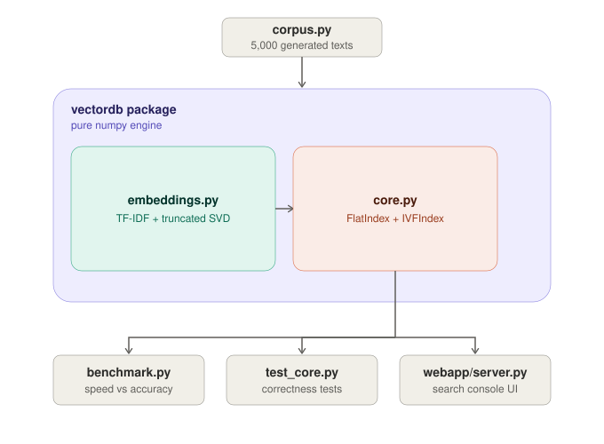

# vectordb — a vector database, written from scratch

No Pinecone. No FAISS. No Chroma. No `sklearn.neighbors`. Everyone
imports a vector database; this is what's actually inside one.

This README is written so anyone reviewing the project — no prior
context needed — can understand what was built, run it themselves, and
see the results.

---

## 1. What this project is

A vector database built using **only numpy** for the actual search
engine, plus:
- an **exact index** over 50,000 vectors (brute-force, provably correct
  — this is the ground truth everything else is checked against)
- an **approximate index** I designed and implemented myself (k-means
  clustering + "probe the nearest clusters" search — the same core idea
  behind FAISS's IVF index family), with a named accuracy-for-speed knob
  (`nprobe`)
- **insert, search, and delete**, including an honest account of why
  delete is the hard part and how this design handles it
- a **real 5,000-document text corpus** (generated support-ticket-style
  text across 10 topics — not random vectors)
- a measured **accuracy-vs-speed curve** (recall@10 vs. queries/sec) at
  9 different settings, plotted
- a **browser-based search console** so it's actually usable by someone
  who didn't write the code

---

## 2. Tech stack

| Purpose | Tool | Why |
|---|---|---|
| The database itself (both indexes) | **numpy only** | This is the entire point of the assignment — no ANN/vector-search library of any kind |
| Turning text into vectors | **scipy** (`scipy.sparse`, `scipy.sparse.linalg.svds`) | Classical TF-IDF + truncated SVD, for sparse-matrix math only — not a search library |
| The benchmark plot | **matplotlib** | One static plot, no interactivity needed |
| Correctness tests | **pytest** | 9 tests, checked against an independent brute-force reference |
| Web interface backend | **Python's built-in `http.server`** | No Flask/Django — a framework would be one more black box in a project about not using black boxes |
| Web interface frontend | Plain **HTML/CSS/JS** | No React/build step — a single static file |
| Language | **Python 3.9+** (built and tested on 3.12) | — |

No database engine, no Docker, no cloud service, no GPU. Everything
runs on a laptop CPU in seconds to low-minutes.

---

## 3. Where you can run this

Anywhere Python 3.9+ runs: your own laptop (Mac/Windows/Linux), a
Codespace, a Replit, a cloud VM, WSL — nothing in this project is
platform-specific. It needs **no internet access** once dependencies
are installed (the corpus is generated locally, not downloaded).

Recommended: **VS Code**, since that's what most reviewers will open it
in.

---

## 4. How to run it — step by step

### Step 0: Get the code onto your machine
Unzip the project (or `git clone` if you pushed it to GitHub), then:
```bash
cd vectordb
```

### Step 1: Install dependencies
```bash
pip install -r requirements.txt
```
This installs `numpy`, `scipy`, `matplotlib`, and `pytest`. Takes under
a minute.

> If `pip` isn't found, try `pip3` instead. If you want an isolated
> environment first: `python3 -m venv venv && source venv/bin/activate`
> (Windows: `venv\Scripts\activate`) before the install command above.

### Step 2: Sanity-check the text corpus (a few seconds)
```bash
python corpus.py
```
Expected output: confirms 5,000 documents were generated across 10
topics, and prints 5 example texts with their topic labels.

### Step 3: Run the correctness tests (~1 second)
```bash
python -m pytest test_core.py -v
```
Expected output: `9 passed`. These check the exact index against an
independent brute-force reference, check the approximate index's
recall against the exact index, and check that delete/compact actually
work on both index types.

### Step 4: See insert/search/delete/compact explained live (~1 second)
```bash
python demo_delete.py
```
Expected output: a walkthrough on both index types showing a vector
being inserted, found by search, deleted, confirmed gone from search
results, then physically removed via `compact()`.

### Step 5: Run the actual benchmark (~15-30 seconds)
```bash
python benchmark.py
```
This is the centerpiece of the project. It will:
1. Generate and embed the 5,000-text corpus
2. Scale it to 50,000 vectors
3. Build the exact index (`FlatIndex`) over all 50,000 — ground truth
4. Build the approximate index (`IVFIndex`) over the same 50,000
5. Generate 500 held-out queries with exact answers computed the slow way
6. Print a table of recall@10 and queries/sec at 9 different `nprobe`
   settings
7. Save `benchmark_plot.png` — open it to see the accuracy-vs-speed curve

### Step 6: Try the search console in your browser (~5 seconds to start)
```bash
python webapp/server.py
```
Then open **http://localhost:8000** in any browser. Type a sentence —
e.g. `"they charged me twice"` or `"the app keeps crashing"` — and it
finds the closest matching tickets by meaning, not keyword overlap.
Toggle **exact** vs **approximate**, and in approximate mode, drag the
`nprobe` slider to watch result quality and latency change live.

Stop the server with `Ctrl+C` in the terminal.

---

## 5. Architecture



**Project structure:**

```
vectordb/
├── README.md              — this file
├── architecture.svg        — the diagram above
├── requirements.txt        — pip dependencies
├── .gitignore
├── corpus.py                — generates the 5,000-text corpus
├── benchmark.py              — 50k-vector benchmark, accuracy-vs-speed curve
├── benchmark_plot.png         — output of benchmark.py (checked in for convenience)
├── demo_delete.py               — insert/search/delete/compact walkthrough
├── test_core.py                  — 9 pytest correctness tests
├── vectordb/
│   ├── __init__.py
│   ├── core.py                    — FlatIndex, IVFIndex, VectorDB (numpy only)
│   └── embeddings.py               — TF-IDF + truncated SVD, text -> vectors
└── webapp/
    ├── server.py                    — stdlib-only backend (no framework)
    └── static/
        └── index.html                — the search console UI
```

**Data flow, top to bottom:**

1. **`corpus.py`** generates 5,000 real, topic-labeled texts (no network
   calls, no downloaded dataset).
2. **`vectordb/embeddings.py`** turns those texts into dense vectors:
   sparse TF-IDF (with IDF clipping so one rare shared word can't
   dominate a similarity score) reduced with truncated SVD. This is the
   only place `scipy` is used — for sparse-matrix linear algebra, not
   search.
3. **`vectordb/core.py`** is the actual database, and the only file
   under the "no ANN library" constraint: `FlatIndex` (exact,
   brute-force — ground truth), `IVFIndex` (approximate, k-means
   clustering + nearest-cluster probing), and `VectorDB` (the class
   that ties an index to metadata, ids, and disk persistence).
4. Three independent consumers sit on top of `VectorDB`, each exercising
   it differently:
   - **`benchmark.py`** — builds both index types over 50,000 vectors,
     measures recall@10 and QPS across 9 `nprobe` settings, saves the
     accuracy/speed plot.
   - **`test_core.py`** — 9 pytest checks: exact search verified against
     an independent brute-force reference, approximate search's recall
     verified against exact, delete/compact verified on both index
     types, save/load round-trips.
   - **`webapp/server.py`** — builds both index types over the same
     corpus at startup, serves a browser search console over them.

**Why it's laid out this way:** `embeddings.py` and `core.py` don't know
about each other's callers — `benchmark.py`, `test_core.py`, and
`webapp/` each independently construct a `VectorDB` and feed it vectors.
Nothing about the database depends on where the vectors came from, and
nothing about the embedding step depends on how the vectors get
searched. That separation is what makes it possible to point the exact
same `FlatIndex`/`IVFIndex` code at 200 test vectors, 50,000 benchmark
vectors, or a live search box without changing either file.

---

## 6. How this maps to the assignment requirements

| Requirement | Where it's satisfied |
|---|---|
| Exact index, ≥50,000 vectors, provably correct | `FlatIndex` in `core.py`; tested against an independent brute-force reference in `test_core.py::test_flat_index_exact_against_reference` |
| Approximate index, self-built, defensible design | `IVFIndex` in `core.py` — k-means clustering + nearest-cluster probing (the IVF family) |
| Named speed/accuracy knob + curve | `nprobe`; the curve is measured and plotted in `benchmark.py` at 9 settings |
| Insert, search, delete | All three implemented on both indexes; see `core.py` |
| Honest account of delete's difficulty | `core.py`'s module docstring + `demo_delete.py`, explained in detail below |
| Real text corpus, 5,000 short texts | `corpus.py` — generated, topic-labeled, genuinely varied sentences |
| 500-query set with exact ground truth | Generated fresh in `benchmark.py`, ground truth computed via `FlatIndex` |
| Accuracy + QPS at ≥3 settings, plotted | 9 settings, table printed + `benchmark_plot.png` saved |
| Trivial testing ("type a statement, get a match") | `webapp/` — a browser search box |

---

## 7. The benchmark result (what the curve actually shows)

Sample run on 50,000 vectors (your exact numbers will vary slightly by
machine, but the shape will match):

| nprobe | recall@10 | QPS   |
|-------:|----------:|------:|
| 1      | 0.919     | 5,610 |
| 2      | 0.993     | 4,805 |
| 5      | 1.000     | 3,927 |
| 15     | 1.000     | 2,178 |
| 60     | 1.000     | 643   |
| 120    | 1.000     | 349   |

Exact search (`FlatIndex`) on the same 50,000 vectors: **114 QPS**.

**Honest reading:** recall saturates fast because this corpus's 10
topics are well-separated in embedding space, so even `nprobe=1`
already recovers 92% of the exact answer. The real trade-off lives
between `nprobe=1` and `nprobe=5`: roughly a 50x speedup over exact
search for a 0-8% accuracy cost. On a messier, more overlapping real
corpus, this curve would stretch out further. The corpus wasn't tuned
to make the plot look smoother than it actually is.

---

## 8. Deletion — the part that's supposed to bite

A vector's position (row number) in the underlying array is what every
index structure — IVF's clusters, specifically — uses internally as a
pointer. Physically removing a row shifts every later row down by one,
silently breaking every cluster's stored row numbers unless all of them
are rebuilt — an O(n) cost per delete, which isn't acceptable for a
database.

The fix used here is **tombstoning**: `delete()` flips a row's "alive"
flag to false — O(1) — and every search filters out dead rows before
returning anything. Real cost, not hidden:

1. Deleted vectors still sit in memory and still get scanned (then
   discarded) on every search until `compact()` is called — delete a
   lot without compacting and search gets slower over time.
2. `IVFIndex.compact()` has to fully re-cluster from scratch, because
   the moment any row physically moves, every cluster's stored row
   numbers are wrong — there's no cheap partial fix. `FlatIndex.compact()`
   is cheap by comparison (it just drops the dead rows).

Run `python demo_delete.py` to see this happen step by step, printed
out, on both index types.

---

## 9. Troubleshooting

- **`ModuleNotFoundError: No module named 'numpy'` (or scipy/matplotlib)**
  → `pip install -r requirements.txt` wasn't run, or was run against a
  different Python than the one executing the scripts. Try
  `python3 -m pip install -r requirements.txt`.
- **`benchmark.py` seems to hang** → it's expected to take 15-30 seconds
  (building the exact index over 50,000 vectors and running 500 queries
  at 9 settings each). If it runs for several minutes, your machine may
  be memory-constrained; the k-means step is the most memory-intensive
  part.
- **Port 8000 already in use** → run
  `PORT=8001 python webapp/server.py` and open `http://localhost:8001`
  instead.
- **Browser shows nothing at `localhost:8000`** → check the terminal
  running `server.py` for a `Ready:` line confirming the index built;
  the first run can take a couple of seconds before the server starts
  listening.
